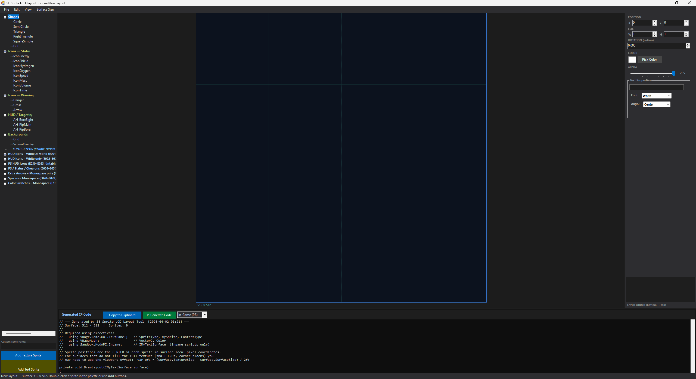
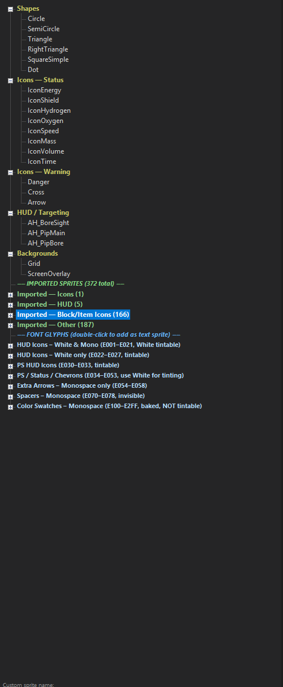
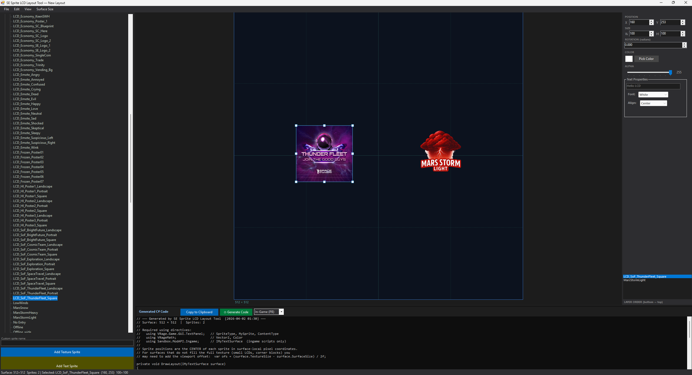
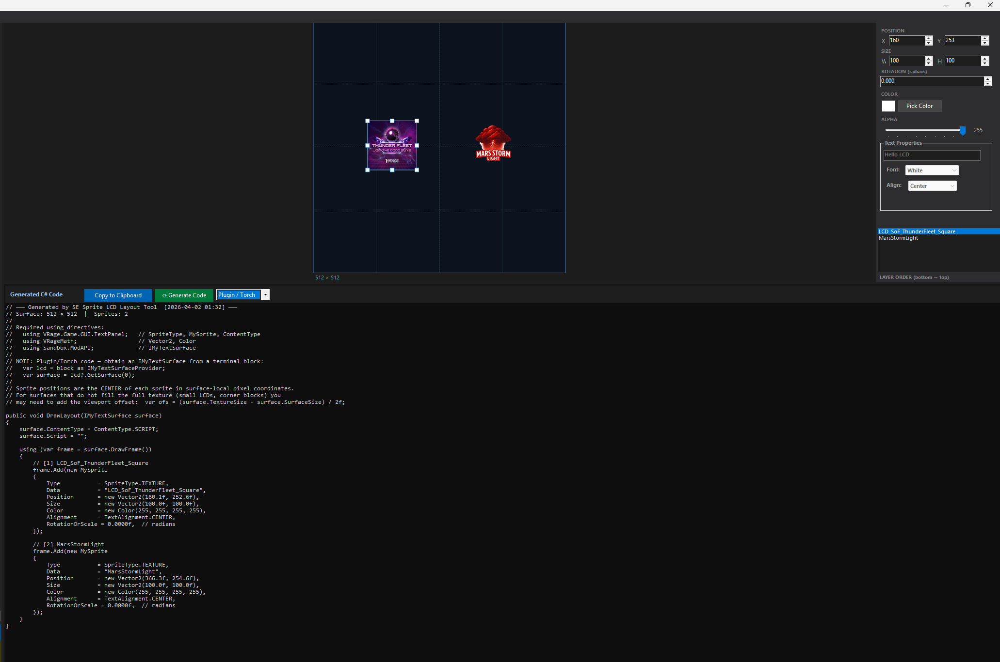
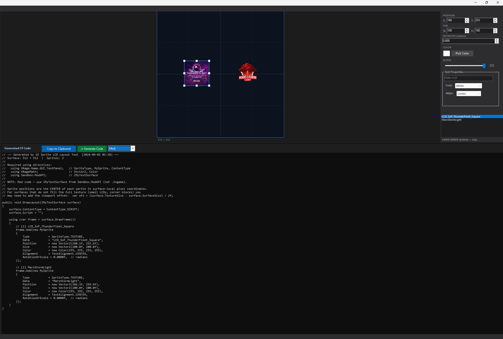
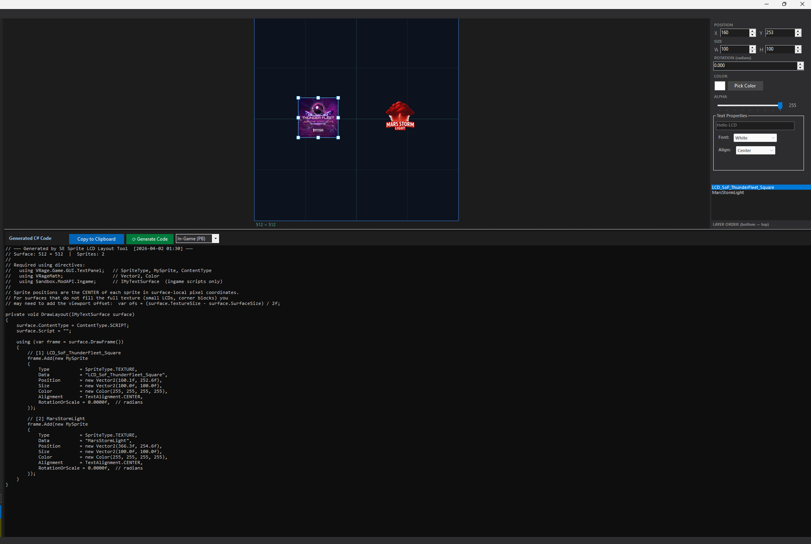
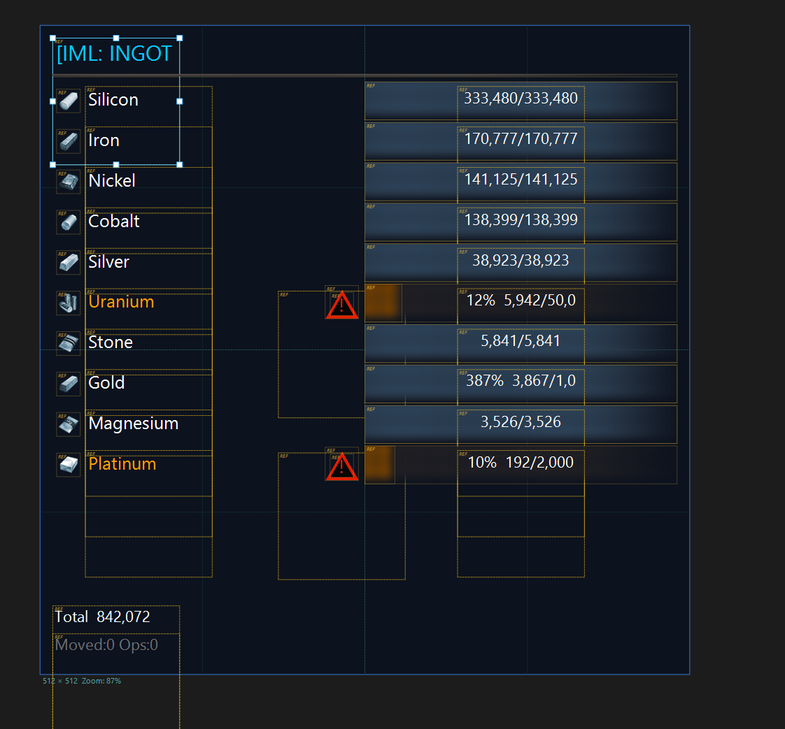
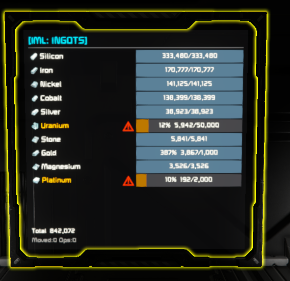

# SE Sprite LCD Layout Tool

A powerful **WYSIWYG visual editor** for designing custom LCD sprite layouts in **[Space Engineers](https://store.steampowered.com/app/244850/Space_Engineers/)**.

Design your screens with drag & drop, preview real in-game textures, then export clean, ready-to-paste C# code for **Programmable Blocks**, **mods**, **Torch/SE plugins**, or **Pulsar client-side plugins**.


---

## 📑 Table of Contents

| Section | Description |
|---|---|
| [✨ Features](#-features) | Visual canvas, texture previews, sprite catalog, code generation, compiler, animation, snapshots, multi-select layers |
| [🚀 Getting Started](#-getting-started) | Requirements, running the tool, importing sprite names |
| [📖 Workflow](#-workflow) | Step-by-step usage guide |
| [📸 Snapshot Helpers & Live Streaming](#-snapshot-helpers--live-lcd-streaming) | Optional — mostly superseded by the built-in compiler; still useful without Roslyn or for live streaming. Includes snapshot tagging |
| [Screenshots](#screenshots) | Editor canvas, catalog, code generation, in-game results, demo videos |
| [⌨️ Keyboard Shortcuts](#️-keyboard-shortcuts) | All hotkeys and mouse controls |
| [Contributing](#contributing) | Bug reports, feature requests, PRs |
| [License](#license) | MIT |
| [📝 Changelog](#-changelog) | Version history (v1.0.0 → v2.4.0) |

---

## ✨ Features

### 🎨 Visual Canvas Designer
- **Drag & drop** sprite placement on a pixel-accurate LCD canvas
- **Zoom & pan** with mouse wheel and middle-click drag
- **Snap to grid** with configurable grid size
- **Constrain to surface** — optional toggle to keep sprites within the LCD surface bounds during drag and nudge
- **Resize handles** for quick sprite scaling
- **Rotation** support for texture sprites
- **Layer ordering** — move sprites up/down in the draw order
- **Multi-select** — Shift-click sprites directly on the **canvas** or in the **layer list** to build a selection; batch **delete**, **duplicate**, and **hide/show** operations apply to the entire selection
- **Layer visibility** — right-click **Hide Selected** to hide one or more sprites, or **Hide Layers Above** to reveal buried sprites; **Show All Layers** restores full visibility
- **Undo/Redo** with full history
- **Dark theme** UI matching the Space Engineers aesthetic

### 🖼️ Real Texture Previews
- **Auto-detects** your Space Engineers installation via Steam registry
- **Loads actual SE textures** (DDS, PNG, JPG) from your local Content directory
- **Full DDS format support** — BC1 (DXT1), BC3 (DXT5), BC7 (BPTC with DX10 headers), and uncompressed 32-bit BGRA
- **Mod texture support** — loads textures from local mods (`%APPDATA%\SpaceEngineers\Mods\`) and Steam Workshop mods
- **SBC definition parsing** — discovers sprite→texture mappings from LCDTextureDefinition, TransparentMaterial, and block/item Icon elements
- **MyObjectBuilder icons**, faction logos, and **ColorMatrix tinting** preview

### 📋 Sprite Catalog
- **Built-in sprites** — shapes, icons, HUD elements, backgrounds
- **Glyph catalog** — Unicode symbols available in SE fonts (White, Monospace, etc.) with tint support
- **User sprite import** — paste the output of `GetSprites()` from a Programmable Block
- **Auto-categorisation** and persistent catalog (`imported_sprites.txt`)

### 💻 Code Generation & Import
- **Four output modes:**
  - **In-Game (PB)** — `Sandbox.ModAPI.Ingame` (private method)
  - **Mod** — `Sandbox.ModAPI` (public method)
  - **Plugin / Torch** — `Sandbox.ModAPI` with `IMyTextSurfaceProvider` hints
  - **Pulsar** — `VRage.Plugins.IPlugin` with `Init`/`Update`/`Dispose` lifecycle and `MyEntities`/`MyCubeGrid` surface access pattern
- Smart **code parser** supporting many C# styles (object initializers, constructors, factory methods, assignments, fully-qualified enums)
- **Code round-trip** — paste your existing source code, edit visually, and get your original code back with only the changed properties patched in (colors, textures, fonts). Works with both static layouts and dynamic code (loops, switch/case, expressions)
- **Expression literal editing** — the SOURCE VALUES panel extracts all literal values (Color, Vector2, float, string) from the source context surrounding each sprite and offers type-specific inline editing:
  - **Color** swatches for `new Color(R,G,B)`, `Color.White`, etc.
  - **Vector2** coordinate displays for `new Vector2(X, Y)` with property context (Position, Size)
  - **Float** numeric fields for `RotationOrScale = 0.8f` and similar assignments
  - **String** text fields for `Data = "SquareSimple"`, `FontId = "White"`, etc.
  - All edits are offset-targeted — the patcher replaces only the exact literal in your original source, preserving all surrounding expressions, ternaries, and control flow
  - Unified offset management keeps all tracked literal positions consistent across multi-edit sessions
- One-click **Copy to clipboard**

### 🔧 Built-in Code Compiler & Executor
- **Compile and run SE LCD scripts directly inside the tool** — no need for Space Engineers, a Programmable Block, or any external build step
- **Three script types auto-detected and supported:**
  - **LCD Helper** — standalone render methods with `List<MySprite>` first parameter (e.g. `RenderPanel(sprites, 512f, 10f, 1f)`)
  - **Programmable Block (PB)** — full PB scripts extending `MyGridProgram` with `Main()` entry point. Paste your entire PB script and the tool detects `Main(string, UpdateType)`, wires up functional stubs for `Me`, `Runtime`, `GridTerminalSystem`, runs the constructor body, calls `Main()`, and captures every sprite drawn via `frame.Add()` — no modifications to your code needed
  - **Mod / Plugin** — scripts with methods that accept `IMyTextSurface`. The tool creates a functional stub surface, passes it to your render method, and captures sprites drawn through `DrawFrame().Add()`
- The result label shows **`[PB]`**, **`[Mod]`**, **`[Pulsar]`**, or **`[LCD]`** tags so you always know which script type was detected
- Uses the **Roslyn C# compiler** (`csc.exe`) from your local Visual Studio installation (auto-detected via `vswhere.exe`)
- Compiles with `/langversion:7.3` and `/optimize+`, targeting the standard .NET Framework assemblies
- **Comprehensive Space Engineers type stubs** compiled alongside your code:
  - Core types: `MySprite`, `Vector2`, `Vector3D`, `Color`, `SpriteType`, `TextAlignment`, `MySpriteDrawFrame`, `ContentType`
  - PB infrastructure: `MyGridProgram`, `IMyProgrammableBlock`, `IMyRuntime`, `IMyGridTerminalSystem`, `UpdateType`, `UpdateFrequency`
  - Surface types: `IMyTextSurface` (with `ScriptBackgroundColor`/`ScriptForegroundColor`), `IMyTextSurfaceProvider`, `IMyTerminalBlock` (with `GetProperty()`/`GetAction()`/`GetInventory()`)
  - Block interfaces: `IMyFunctionalBlock`, `IMyBatteryBlock`, `IMyGasTank`, `IMyShipConnector`, `IMyThrust`, `IMyGyro`, `IMySensorBlock`, `IMyDoor`, `IMyLightingBlock`, `IMyMotorStator`, `IMyPistonBase`, `IMyShipController` (with `GetNaturalGravity()`, `MoveIndicator`, `RotationIndicator`)
  - Block groups: `IMyBlockGroup` (with `GetBlocksOfType<T>()`, `Name`), `IMyGridTerminalSystem.GetBlockGroupWithName()`
  - Inventory types: `IMyInventory` (with `CurrentVolume`, `MaxVolume`, `GetItems()`), `MyInventoryItem`, `MyFixedPoint`, `MyItemType`
  - Terminal: `ITerminalProperty`, `ITerminalAction` with stub implementations
  - Functional concrete stubs: `StubTextSurface` (working `DrawFrame()`, `WriteText()`, configurable size), `StubProgrammableBlock` (2 surfaces, `GetSurface()`), `StubRuntime` (with `UpdateFrequency`), `StubGridTerminalSystem` (`GetBlocksOfType<T>()`, `GetBlockWithId()`, `GetBlockGroupWithName()`), `StubBlockGroup`, `StubInventory`
  - Enums: `ChargeMode`, `MyShipConnectorStatus`, `DoorStatus`, `PistonStatus`
  - Math helpers: `MathHelper` (Pi, Clamp, Lerp, ToRadians, ToDegrees), extended `Color` constructors (float RGBA, alpha override), additional named colors (Yellow, Cyan, Magenta, Gray, Orange), `Color * float` operator, `MySprite.CreateSprite()`
  - Scripts using `using VRageMath`, `using VRage.Game.GUI.TextPanel`, `using Sandbox.ModAPI.Ingame`, `using VRage`, or `using VRage.Game.ModAPI.Ingame` compile without modification
- **Sprite capture via `SpriteCollector`** — `MySpriteDrawFrame.Add()` feeds into a global collector so sprites drawn through the SE surface API (not just `List<MySprite>`) are captured and rendered on the canvas
- **Automatic entry point detection** adapts to the script type:
  - LCD Helper: scans for methods with `List<MySprite>` first parameter
  - PB: detects `Main(string, UpdateType)`, `Main(string)`, or `Main()` and suggests `Main("", UpdateType.None)`
  - Mod: detects methods with `IMyTextSurface` parameter and suggests e.g. `DrawHUD(surface)`
  - All detected entry points are listed; select any one to execute, or type a custom call expression
- **PB constructor support** — the tool extracts the body of your `Program()` constructor and runs it before `Main()`, so `Runtime.UpdateFrequency` assignments and field initialisation work correctly
- **5-second timeout guard** — execution runs on a background thread with a hard timeout to catch infinite loops
- **Compilation errors** are reported with clear, script-type-aware messages (temp file paths stripped for readability)
- **Use from the Paste Layout Code dialog** — accessible via **Edit → Paste Layout Code…**:
  1. Paste your SE rendering code into the top editor (PB script, mod code, or standalone helpers)
  2. Click **▶ Execute Code** (or double-click a detected method in the list)
  3. The tool compiles, runs, and shows the resulting sprite count with script type (e.g. "✔ 42 sprites [PB]")
  4. Click **Import** to bring the executed sprites onto the canvas — or combine with a runtime snapshot for merged positions
- **Call isolation mode** — when you have a layout with multiple rendering methods, execute a single call to isolate only its sprites on the canvas (dimming the rest), then click "Show All" to restore the full frame
- **Auto re-execution after expression edits** — when you edit a color, vector, float, or string literal in the SOURCE VALUES panel, the tool automatically re-compiles and re-executes your patched source code to refresh the canvas in real time

### 🎬 Animation Playback
- **Animate any SE LCD script** — the tool compiles your code and runs it frame-by-frame on a timer, so you can preview animated displays (oscilloscopes, radar sweeps, gauge bars, starfields, progress bars, etc.) directly in the editor
- **Auto-detection of all rendering methods** — all `void` methods with `List<MySprite>` or `IMyTextSurface` parameters are discovered and called every frame, showing the full animated scene
- **Snapshot-anchored playback** — capture a live snapshot from the game, apply it, then press Play:
  - Positions from the snapshot become the authoritative canvas coordinates
  - On the first animation frame, per-sprite position offsets are computed between the snapshot and the animation output
  - Every subsequent frame applies those offsets so animated movement is preserved while the scene sits at the correct in-game positions
  - Sprites in the snapshot with no animation counterpart remain visible as static elements
- **Play / Pause / Stop / Step** controls with script-type indicator (`PB`, `Mod`, `LCD`) and tick counter
- **Works with all four script types** — Programmable Block, Mod, Pulsar, and LCD Helper scripts
- Layout is **fully restored** when animation stops — your editable sprites, source tracking, and positions return to their pre-animation state

### 📸 LCD Snapshot Capture & Live Streaming
- **Four ready-to-paste helper snippets** generated by the tool — one each for **Programmable Block**, **Mod**, **Torch/Plugin**, and **Pulsar** targets
- Capture live LCD panels (resolved sprites with final positions, sizes, colors, etc.)
- Import as a fully **editable layout** or as a visual **reference overlay** (dotted amber border + [REF] tag)
- **Live LCD Streaming (Plugin only)** — stream frames in real time from a running game to the layout tool over a named pipe
  - **Self-disarming timer** (default 60 seconds) — the code lies completely dormant with zero overhead until triggered, then auto-stops
  - **Pause/Resume** — freeze a frame in the editor for visual editing, resume to continue the live stream
  - Start from the layout tool: **Edit → Start Live Listening**, then trigger `StartLcdStream()` in your plugin
- **Snapshot Merge** — paste your original source code *and* a runtime snapshot side-by-side to get the best of both:
  - **Original code** preserves source tracking, round-trip patching, and all expressions/control flow
  - **Snapshot** provides the true runtime-resolved positions and sizes
  - Sprites are matched by **(Type + Data)** in occurrence order, with positional fallback for expression-generated data
  - Import baselines are refreshed after merging, so the round-trip code generator treats snapshot positions as the new baseline (not as user edits)
- **Snapshot tagging** — the generated helper code includes a `_snapshotTag` field you can set to a label (e.g. `"MyPulsarHUD"`). When set, the serialized output includes a `// @SnapshotTag: MyPulsarHUD` header line. The layout tool parses this tag and displays it in the status bar on import, making it easy to identify which plugin or script produced a given snapshot — especially useful when multiple plugins render to the same LCD
  - **Dormant sprite awareness** — if a snapshot captures fewer sprites than expected (e.g. 4 sprites missing), this is typically because some sprites were inactive/dormant during the capture frame, not a merge bug. The tag helps you verify which plugin produced the snapshot so you can re-capture at a better moment
- Standalone **Apply Runtime Snapshot** dialog (**Edit → Apply Runtime Snapshot…**) — apply a snapshot to an already-imported layout at any time
- Extremely useful for debugging dynamic LCDs or starting from an existing complex display

### 📁 File Operations
- Save/Load layouts in `.seld` (XML) format — **including original script source code**, so animation, code round-trip, and detected methods are fully restored on load
- **Bidirectional VS Code sync** — **File → Sync Script File (VS Code)…** watches a `.cs` file for external edits and writes code changes from the canvas back to the file in real time
- Built-in surface presets: 1×1 LCD (512×512), Wide LCD (512×256), Corner LCD (1024×512), custom sizes

---

## 🚀 Getting Started

### Requirements
- Windows + **.NET Framework 4.8**
- Space Engineers (recommended for full texture previews)

#### Built-in Compiler Dependencies (optional — only needed for ▶ Execute Code)

The built-in code compiler lets you compile and run SE LCD scripts directly inside the tool. It requires the **Roslyn C# compiler** (`csc.exe`) which ships with Visual Studio. The tool auto-discovers it — no manual configuration needed — but one of the following must be installed:

| Option | What to install | Notes |
|---|---|---|
| **Visual Studio 2019, 2022, or later** | Any edition (Community is free) | The tool uses `vswhere.exe` to find your VS installation, then locates `csc.exe` at `<VS>\MSBuild\Current\Bin\Roslyn\csc.exe`. Any workload that includes the C# compiler will work — e.g. ".NET desktop development" or just the "C# and Visual Basic Roslyn compilers" individual component. |
| **Visual Studio Build Tools** | [Download](https://visualstudio.microsoft.com/downloads/#build-tools-for-visual-studio-2022) (free, ~1-2 GB) | A lightweight install without the full IDE. Select the **"MSBuild tools"** workload or the **"C# and Visual Basic Roslyn compilers"** component. |

> **If neither is installed:** the tool works normally for all other features (canvas editing, code generation, import, snapshots, live streaming). Only the **▶ Execute Code** button in the Paste Layout Code dialog will show an error asking you to install Visual Studio.

> **How it works under the hood:** the tool runs `vswhere.exe` (located at `%ProgramFiles(x86)%\Microsoft Visual Studio\Installer\vswhere.exe`) to find the latest VS installation path, then looks for `csc.exe` inside `MSBuild\Current\Bin\Roslyn\`. The compiler is invoked as an external process — no Roslyn NuGet packages or SDKs are bundled with the tool.

### Running the Tool
1. Build the solution or download a release
2. Run `SESpriteLCDLayoutTool.exe`
3. The tool auto-detects your Space Engineers path on first launch

### Importing All Sprite Names (Recommended)
Run this script once in a Programmable Block:

```csharp
public Program()
{
    var surface = Me.GetSurface(0);
    var list = new List<string>();
    surface.GetSprites(list);
    Me.CustomData = string.Join("\n", list);
}
```

Copy the Custom Data, then in the tool: **Edit → Import Sprite Names** and paste.

---

## 📖 Workflow

1. Browse or search sprites in the catalog on the left
2. Drag them onto the canvas (or type a custom name)
3. Arrange, resize, rotate, and reorder layers
4. Select your target output style (In-Game / Mod / Plugin)
5. Click **Copy Code** and paste into your script!

---

## 📸 Snapshot Helpers & Live LCD Streaming

> **Note:** This section is completely optional. Since v2.0.0 the tool has a **built-in Roslyn compiler** that can compile and execute your SE LCD code directly — paste your script, press **▶ Execute Code**, and the resulting sprites appear on the canvas with their true runtime positions. **If you have Visual Studio (or the Build Tools) installed, you likely don't need snapshots at all.** Snapshots remain useful if you don't have Roslyn available, or if you want to capture frames from a *live running game* (e.g. live LCD streaming over a named pipe).

> **Important:** The snapshot helper snippet must be added **inside the plugin or mod that actually renders the LCD** you want to capture. Sprites are drawn by that plugin's own code, so a separate script or programmable block cannot read them — you can only capture what the owning plugin writes to the surface.

The tool generates ready-to-paste helper code via the **Copy Snapshot Helper** button. Select your target (In-Game / Mod / Plugin / Pulsar) and copy. All four variants share the same core `SnapshotCollect()` + `SerializeSnapshot()` methods (including optional `_snapshotTag` identification) — the differences are in output transport, access modifiers, and surface access patterns.

---

### Programmable Block (PB)

Drop this into your PB script. After your drawing code, call `SnapshotCollect(mySprites)` then copy the result from CustomData.

```csharp
// ─── LCD Snapshot Helper (Programmable Block) ───────────────────────────
// After your drawing code:
//   SnapshotCollect(mySprites);
//   Me.CustomData = SerializeSnapshot();
// Then copy the PB's Custom Data and paste into the layout tool.

List<MySprite> _snapshotSprites = new List<MySprite>();

/// <summary>
/// Set this to identify which script produced the snapshot (e.g. "MyHUD").
/// The layout tool displays this tag on import.
/// </summary>
string _snapshotTag = "";

void SnapshotCollect(List<MySprite> sprites)
{
    _snapshotSprites.Clear();
    _snapshotSprites.AddRange(sprites);
}

string SerializeSnapshot()
{
    var sb = new StringBuilder();
    sb.AppendLine("// ── LCD Snapshot ──");
    sb.AppendLine($"// Captured: {DateTime.Now:yyyy-MM-dd HH:mm}  |  Sprites: {_snapshotSprites.Count}");
    if (!string.IsNullOrEmpty(_snapshotTag))
        sb.AppendLine($"// @SnapshotTag: {_snapshotTag}");
    sb.AppendLine();
    for (int i = 0; i < _snapshotSprites.Count; i++)
    {
        var s = _snapshotSprites[i];
        sb.AppendLine("frame.Add(new MySprite");
        sb.AppendLine("{");
        sb.AppendLine($"    Type           = SpriteType.{s.Type},");
        sb.AppendLine($"    Data           = \"{s.Data}\",");
        if (s.Position.HasValue)
            sb.AppendLine($"    Position       = new Vector2({s.Position.Value.X:F1}f, {s.Position.Value.Y:F1}f),");
        if (s.Size.HasValue)
            sb.AppendLine($"    Size           = new Vector2({s.Size.Value.X:F1}f, {s.Size.Value.Y:F1}f),");
        if (s.Color.HasValue)
            sb.AppendLine($"    Color          = new Color({s.Color.Value.R}, {s.Color.Value.G}, {s.Color.Value.B}, {s.Color.Value.A}),");
        if (s.FontId != null)
            sb.AppendLine($"    FontId         = \"{s.FontId}\",");
        sb.AppendLine($"    Alignment      = TextAlignment.{s.Alignment},");
        sb.AppendLine($"    RotationOrScale = {s.RotationOrScale:F4}f,");
        sb.AppendLine("});");
        sb.AppendLine();
    }
    return sb.ToString();
}
```

**Usage in your PB `Main()`:**
```csharp
SnapshotCollect(mySprites);
Me.CustomData = SerializeSnapshot();
```

---

### Mod

Add this to your mod's session component or drawing class. Output is shown via the in-game mission screen.

```csharp
// ─── LCD Snapshot Helper (Mod) ──────────────────────────────────────────
// Required usings:
//   using System.Text;
//   using VRage.Game.GUI.TextPanel;
//   using VRageMath;

public List<MySprite> _snapshotSprites = new List<MySprite>();
public string _snapshotTag = ""; // identifies the snapshot source

public void SnapshotCollect(List<MySprite> sprites) { /* ...same as PB... */ }
public string SerializeSnapshot() { /* ...same serializer, emits @SnapshotTag header when set... */ }
```

**Usage:**
```csharp
SnapshotCollect(mySprites);
var output = SerializeSnapshot();
MyAPIGateway.Utilities.ShowMissionScreen("Snapshot", "", "", output);
```
Copy from the mission screen and paste into the layout tool.

---

### Torch / Plugin (with Live Streaming)

The plugin variant includes everything above *plus*:
- **One-shot file snapshot** via `SnapshotLcd()` — writes to a file and logs via NLog
- **Live streaming** via named pipe — `StartLcdStream()` / `StopLcdStream()` / `StreamFrame()`

```csharp
// ─── LCD Snapshot Helper (Torch / Plugin) ───────────────────────────────
// Required usings:
//   using System;
//   using System.Collections.Generic;
//   using System.IO;
//   using System.IO.Pipes;
//   using System.Text;
//   using NLog;
//   using Sandbox.ModAPI;
//   using VRage.Game.GUI.TextPanel;
//   using VRageMath;

private static readonly Logger Log = LogManager.GetCurrentClassLogger();

public List<MySprite> _snapshotSprites = new List<MySprite>();
public string _snapshotTag = ""; // identifies the snapshot source
public void SnapshotCollect(List<MySprite> sprites) { /* ...same... */ }
public string SerializeSnapshot() { /* ...same, emits @SnapshotTag header when set... */ }

// ── One-shot file snapshot ───────────────────────────────────────────────

public void SnapshotLcd(IMyTextSurface surface, string label = "LcdSnapshot")
{
    if (surface == null) { Log.Warn("SnapshotLcd: surface is null"); return; }
    if (_snapshotSprites.Count == 0)
    {
        Log.Warn("SnapshotLcd: no sprites collected");
        return;
    }
    string output = SerializeSnapshot();
    string path = Path.Combine(
        StoragePath ?? Directory.GetCurrentDirectory(),
        $"{label}_{DateTime.Now:yyyyMMdd_HHmmss}.cs");
    File.WriteAllText(path, output);
    Log.Info($"LCD snapshot saved: {path}  ({_snapshotSprites.Count} sprites)");
}

// ── Live LCD Streaming (self-disarming) ─────────────────────────────────

private NamedPipeClientStream _lcdPipe;
private DateTime _lcdStreamExpiry;
private bool _lcdStreamActive;

public void StartLcdStream(int seconds = 60)
{
    StopLcdStream();
    try
    {
        _lcdPipe = new NamedPipeClientStream(".", "SELcdSnapshot", PipeDirection.Out);
        _lcdPipe.Connect(2000);
        _lcdStreamExpiry = DateTime.UtcNow.AddSeconds(seconds);
        _lcdStreamActive = true;
        Log.Info($"LCD stream started — auto-disarms in {seconds}s");
    }
    catch (Exception ex)
    {
        Log.Warn($"LCD stream failed to connect: {ex.Message}");
        StopLcdStream();
    }
}

public void StopLcdStream()
{
    _lcdStreamActive = false;
    try { _lcdPipe?.Dispose(); } catch { }
    _lcdPipe = null;
}

public void StreamFrame()
{
    if (!_lcdStreamActive) return; // dormant — zero overhead

    if (DateTime.UtcNow > _lcdStreamExpiry)
    {
        Log.Info("LCD stream expired — auto-disarmed");
        StopLcdStream();
        return;
    }

    if (_snapshotSprites.Count == 0) return;

    try
    {
        string frame = SerializeSnapshot();
        byte[] payload = Encoding.UTF8.GetBytes(frame);
        byte[] header = BitConverter.GetBytes(payload.Length);
        _lcdPipe.Write(header, 0, 4);
        _lcdPipe.Write(payload, 0, payload.Length);
        _lcdPipe.Flush();
    }
    catch (Exception ex)
    {
        Log.Warn($"LCD stream write failed: {ex.Message}");
        StopLcdStream();
    }
}
```

**Usage in your render loop:**
```csharp
SnapshotCollect(mySprites);   // always — cheap list copy
StreamFrame();                // no-op when dormant; auto-disarms after timeout
```

**Triggering from a chat command:**
```csharp
// e.g. /lcd watch
StartLcdStream(60);   // streams for 60 seconds then auto-disarms
```

> ⚠️ **Important — call order for `SnapshotCollect()`**
>
> Space Engineers does not expose a way to read back sprites that have already been committed to a draw frame.
> Your plugin code must call `SnapshotCollect(sprites)` with the sprite list **before** (or at the same time as) passing them to `frame.Add(...)` — not after.
>
> If `SnapshotCollect` is called after the frame is flushed, the snapshot and live feed will silently produce an empty or zero-sprite result with no error.
> This is an SE API limitation, not a bug in the tool.
>
> **Correct order:**
> ```csharp
> // 1. Build your sprite list
> var sprites = BuildSprites();
>
> // 2. Collect BEFORE flushing to frame
> SnapshotCollect(sprites);
>
> // 3. Then flush to frame
> using (var frame = surface.DrawFrame())
>     foreach (var s in sprites) frame.Add(s);
> ```

> **Key point:** When `_lcdStreamActive` is `false`, `StreamFrame()` returns on its very first line — **zero overhead**.

---

### Pulsar Plugin

Pulsar (client-side) plugins implement `VRage.Plugins.IPlugin` and don't have access to `GridTerminalSystem`. The generated snippet includes the same snapshot + live streaming code as Torch, but with surface access via `MyEntities` / `MyCubeGrid` iteration.

```csharp
// ─── LCD Snapshot Helper (Pulsar Plugin) ─────────────────────────────────────────
// Add this to your IPlugin class.
// Required usings:
//   using Sandbox.Game.Entities;       // MyCubeGrid, MyEntities
//   using Sandbox.ModAPI;               // IMyTextPanel
//   using VRage.Game.Entity;            // MyEntity
//   using VRage.Game.GUI.TextPanel;     // MySprite, SpriteType
//   using VRage.Plugins;                // IPlugin
//   using VRageMath;                    // Vector2, Color

// Surface access (Pulsar — no GridTerminalSystem):
foreach (MyEntity e in MyEntities.GetEntities())
{
    var grid = e as MyCubeGrid;
    if (grid == null) continue;
    foreach (var slim in grid.CubeBlocks)
    {
        var panel = slim.FatBlock as IMyTextPanel;
        if (panel != null && panel.CustomName == "YourLCD")
            surface = panel;
    }
}

public List<MySprite> _snapshotSprites = new List<MySprite>();

/// <summary>
/// Set this to a unique label (e.g. "MyPulsarHUD") so the layout tool
/// can distinguish snapshots from different plugins on the same LCD.
/// </summary>
public string _snapshotTag = "";

public void SnapshotCollect(List<MySprite> sprites) { /* ...same as Torch... */ }
public string SerializeSnapshot() { /* ...same serializer, emits @SnapshotTag header when set... */ }

public void SnapshotLcd(string label = "LcdSnapshot") { /* ...same file output via NLog... */ }
public void StartLcdStream(int seconds = 60) { /* ...same named pipe streaming... */ }
public void StopLcdStream() { /* ... */ }
public void StreamFrame() { /* ...same — dormant when not active... */ }
public void StartLcdFileStream(string path, int seconds = 60) { /* ...same file streaming... */ }
public void StopLcdFileStream() { /* ... */ }
public void StreamFrameToFile() { /* ...same... */ }
```

**Usage in your `Update()` loop:**
```csharp
SnapshotCollect(mySprites);   // always — cheap list copy
StreamFrame();                // no-op when dormant
```

The full generated snippet (via **Copy Snapshot Helper** with the Pulsar target selected) includes all method bodies, XML doc comments, and the file/pipe streaming code — identical to the Torch variant but with Pulsar-specific usings and surface access guidance.

---

### Live Streaming — Layout Tool Side

1. **Edit → Start Live Listening** — the tool opens a named pipe server and waits
2. In your plugin, trigger `StartLcdStream(60)` via a chat command
3. Frames appear on the canvas in real time as the plugin renders them
4. **Edit → Pause Live Stream** — freezes the current frame so you can drag sprites, edit colors, etc.
5. **Edit → Resume Live Stream** — continues receiving live frames
6. After 60 seconds (or whatever duration you set) the plugin auto-disarms — zero code changes needed
7. **Edit → Stop Live Listening** when you're done

**File-based live streaming (alternative — same machine only)**

1. Pass any file path to `StartLcdFileStream()` in your plugin code
2. In the layout tool, use **Edit → Watch Snapshot File…** and browse to that file
3. The canvas updates roughly every 150 ms (debounced) as the plugin overwrites the file each game tick
4. Use **Edit → Stop Watching File** when done

> File streaming has no connect-order dependency — the layout tool can start watching before or after the plugin begins writing.

### Merging a Snapshot with Your Source Code

The snapshot helpers give you **exact runtime positions**, but your original source code has **round-trip patching**, expressions, and control flow. The merge workflow combines both:

1. **Edit → Paste Layout Code** opens a split dialog:
   - **Top pane** — paste your original plugin/PB source code (the code that *creates* the sprites)
   - **Bottom pane** — paste the snapshot output (the runtime-resolved sprites)
2. Click **Import Sprites** — the tool parses both, matches sprites by `(Type, Data)` in order, and applies the snapshot's positions/sizes to the code-imported sprites
3. **Edit visually** — drag, resize, recolor sprites on the canvas with true positions
4. **Copy Code** — the round-trip generator patches only the properties you changed back into your original source, preserving all loops, `switch`/`case`, expressions, and comments

> **Tip:** If your code uses dynamic/expression-based `Data` values (e.g. string interpolation), the keyed match may not find pairs. In that case the merger falls back to **positional (index) matching** — first sprite in code ↔ first sprite in snapshot, and so on.

#### Applying a Snapshot Later

Already imported your code but forgot the snapshot? Use **Edit → Apply Runtime Snapshot…** to merge a snapshot into the current layout at any time. The merger refreshes import baselines so the positions are treated as the new starting point, not as user edits.

<details>
<summary>📄 Example snapshot output (60 sprites from an IML Ingots panel) — click to expand</summary>

```csharp
// ── LCD Snapshot ──
// Captured: 2026-04-01 21:26:41Z  |  Sprites: 60
// @SnapshotTag: IML-Ingots

var sprites = new List<MySprite>
{
    new MySprite
    {
        Type = SpriteType.TEXT,
        Data = "[IML: INGOTS]",
        Position = new Vector2(10.0f, 10.0f),
        Color = new Color(0, 200, 255, 255),
        FontId = "White",
        RotationOrScale = 0.8500f,
    },
    new MySprite
    {
        Type = SpriteType.TEXTURE,
        Data = "SquareSimple",
        Position = new Vector2(256.0f, 39.6f),
        Size = new Vector2(492.0f, 2.0f),
        Color = new Color(55, 55, 60, 255),
        Alignment = TextAlignment.CENTER,
        RotationOrScale = 0.0000f,
    },
    new MySprite
    {
        Type = SpriteType.TEXTURE,
        Data = "MyObjectBuilder_Ingot/Silicon",
        Position = new Vector2(22.4f, 59.6f),
        Size = new Vector2(18.7f, 18.7f),
        Color = new Color(255, 255, 255, 255),
        Alignment = TextAlignment.CENTER,
        RotationOrScale = 0.0000f,
    },
    new MySprite
    {
        Type = SpriteType.TEXT,
        Data = "Silicon",
        Position = new Vector2(35.7f, 48.2f),
        Color = new Color(255, 255, 255, 255),
        FontId = "White",
        RotationOrScale = 0.6800f,
    },
    new MySprite
    {
        Type = SpriteType.TEXTURE,
        Data = "SquareSimple",
        Position = new Vector2(379.0f, 59.6f),
        Size = new Vector2(246.0f, 29.9f),
        Color = new Color(30, 30, 35, 220),
        Alignment = TextAlignment.CENTER,
        RotationOrScale = 0.0000f,
    },
    // ... 55 more sprites (icons, bar backgrounds, text labels, warning triangles, etc.)
};
```

👉 [View the full snapshot file](docs/iml-snapshot-example.cs)

</details>

---

The snippet above drops into **any** Torch plugin, Pulsar plugin, mod, or PB unchanged — just wire `SnapshotCollect()`, `SnapshotLcd()`, `StartLcdStream()`, or `StartLcdFileStream()` to whatever trigger makes sense for your project (chat command, hotkey, timer, etc.).

<details>
<summary>📋 Worked integration example — IML (InventoryManagerLight) Torch plugin</summary>

The snippets are demonstrated here using **[IML (InventoryManagerLight)](https://github.com/SilentAssassin82/InventoryManagerLight)** — an open-source Torch plugin by the same author. IML is used purely as a concrete reference because its source is publicly available and fully verified. You do not need IML or any specific plugin to use this tool.

### How the snippet maps to IML's chat commands

IML wires each of the three output methods to an in-game chat command:

| IML command | Calls | Output |
|---|---|---|
| `!iml snapshot <tag>` | `SnapshotLcd(surface, label)` | `iml-snapshot-{name}-{timestamp}.cs` — new file each time |
| `!iml watch <tag> [seconds]` | `StartLcdFileStream(path, seconds)` | `iml-live-{name}.cs` — overwritten each game tick (~16 ms) |
| `!iml watchstop <tag>` | `StopLcdFileStream()` | Stops the live feed |

`<tag>` is a CustomData tag on the LCD panel (e.g. `IML:LCD`, `IML:LCD=MISC`). IML converts it to a filename-safe string by replacing ` : \ / * ? " < > |` with `_` — so `IML:LCD=MISC` → `iml-live-IML_LCD_MISC.cs`. Your plugin can use any naming convention.

### Connecting to the layout tool

**One-shot (`SnapshotLcd`):** Run the command → open the written `.cs` file → paste into **Edit → Paste Layout Code**.

**Live feed (`StartLcdFileStream`):** Run the watch command → in the layout tool use **Edit → Watch Snapshot File…** → browse to the `iml-live-*.cs` file. Canvas updates ~every 150 ms while the plugin writes each game tick.

**Named pipe (`StartLcdStream`):** Open **Edit → Start Live Listening** in the layout tool *first* (2-second connect timeout), then trigger `StartLcdStream()` in-game.

### FindPanel — two-pass tag search

The generated snippet's `FindPanel` helper avoids a common false-positive: a single `||` search returns the first block whose name *or* data contains the tag, which can be the wrong block if an unrelated block's name happens to match first. The two-pass approach scans `CustomName` in a complete first pass, then falls back to `CustomData` — so the tag always wins over coincidental name matches.

```csharp
// Your tag can be anything — "MyLCD", "CARGO_DISPLAY", etc.
IMyTextSurfaceProvider panel = FindPanel(allBlocks, "MyTag", out string foundName);
```

</details>

---

## Screenshots

### Editor Canvas


### Sprite Catalog & Texture Previews



### Code Generation





### Snapshot Import


### In-Game Result


### Demo Videos
[](https://youtu.be/Hp9KDFYG17o)
[](https://youtu.be/cE2PVtbPqnQ)

---

## ⌨️ Keyboard Shortcuts

<details>
<summary>Click to expand</summary>

| Shortcut | Action |
|---|---|
| `Ctrl+Z` | Undo |
| `Ctrl+Y` | Redo |
| `Ctrl+S` | Save layout |
| `Ctrl+O` | Open layout |
| `Ctrl+V` | Paste layout code |
| `Ctrl+C` | Copy generated code |
| `Ctrl+D` | Duplicate selected sprite(s) |
| `Delete` | Delete selected sprite(s) |
| `+` / `-` | Move sprite up/down in layer order |
| `Shift+Click` | Extend layer list selection |
| `Ctrl+Click` | Toggle individual layer list selection |
| `G` | Toggle snap to grid |
| Mouse wheel | Zoom canvas |
| Middle-click drag | Pan canvas |

</details>

---

## Contributing

Bug reports, feature requests, and pull requests are welcome!

## License

MIT License

---

## 📝 Changelog

### v2.4.0
- **Canvas multi-select** — Shift+click sprites directly on the canvas to add/remove them from the selection, enabling batch operations without switching to the layer list
- **Hide Selected context menu** — right-click on the canvas shows "Hide Selected (N)" with a count badge when multiple sprites are selected; hides all selected sprites at once
- **Smart brace-aware auto-indent** — select code in the editor and press Tab to intelligently reformat indentation based on brace nesting depth (Shift+Tab to outdent)
- **Auto-indent on Enter** — new lines automatically match the indentation of the current line, with an extra level added after opening braces
- **Fixed switch-case method detection** — the `DetectSwitchCaseRenderMethods` regex now correctly matches fully-qualified enum names (e.g. `case LcdSpriteRow.Kind.Header:`)
- **Fixed source file write prevention** — bidirectional file sync no longer writes generated code back to the original `.cs` source file when the content hash hasn't changed
- **Fixed code jump accuracy** — double-clicking a layer now uses line-based position mapping to jump to the correct sprite definition, even when code edits shift character offsets

### v2.3.0
- **Layout file persistence for animation** — `.seld` files now save and restore the original script source code, so animation playback, code round-trip patching, and detected method lists are fully preserved across save/load cycles
- **VS Code bidirectional file sync** — new **File → Sync Script File (VS Code)…** watches a `.cs` file for external edits (auto-importing on change) and writes canvas code changes back to the file in real time, enabling a seamless split-screen workflow with any external editor
- **Auto-detect script type on code import** — when importing code via paste, file sync, or clipboard monitoring, the code style dropdown automatically switches to the correct target (PB, Mod, Plugin, Pulsar) based on detected script patterns (6 new regex patterns including `IPlugin`, `MySessionComponentBase`, `MyGridProgram`, `void Main`, `IMyTextSurface` parameter, and `VRage.Plugins`)
- **Fixed indentation loss on code round-trip** — leading whitespace is no longer stripped during code generation patches across 3 coordinated fix points in the code generator
- **Fixed FillPie crash on zero-size sprites** — `DrawTextureSprite` now guards against degenerate sprite sizes that caused `ArgumentException` in GDI+ `FillPie`
- **Fixed clipboard paste indentation** — RichTextBox `\n`-only line breaks are now normalized to `\r\n`, preserving indentation when pasting code
- **Fixed CS0841 compiler error in Mod/Pulsar animation** — animation source builders now declare the `sprites` variable before call lines that reference it
- **Fixed sprite doubling in Mod/Pulsar scripts** — conditional `SpriteCollector` merge (only when no call line manages sprites directly), `FilterTopLevelCalls` helper to remove sub-methods called by orchestrators, and full sprite replacement in execute/isolate paths prevent duplicate sprites
- **Fixed isolate mode for Mod/Pulsar scripts** — uses direct sprite replacement instead of snapshot merge, which failed due to runtime vs. static analysis mismatch
- **Fixed animation Play/Step ignoring selected method** — the Play and Step-Forward buttons now check the detected-calls list for a selected method and start focused animation with that method instead of always playing all methods

### v2.2.0
- **Script-type aware animation snippets** — both the simple animation dialog (right-click → Add Animation…) and the keyframe animation dialog now read the current **Code Style** dropdown and generate context-appropriate output
  - **Auto-default `ListVarName`** — PB, Mod, Plugin/Torch, and Pulsar targets default to `frame` (for `MySpriteDrawFrame`); LCD Helper defaults to `sprites` (for `List<MySprite>`)
  - **Target label in dialog title** — dialog title bar shows the active target (e.g. "Animation Snippet [PB]", "Keyframe Animation [Pulsar]")
  - **Context-aware comments** — generated snippets include target-specific header labels (`[PB]`, `[Mod]`, `[Plugin]`, `[Pulsar]`, `[LCD]`), field placement hints (e.g. "add to your Program class" vs. "add to your IPlugin class"), and render method hints (e.g. "In your Main() method" vs. "In your Update() loop")
  - New `TargetScriptType` enum (`LcdHelper`, `ProgrammableBlock`, `Mod`, `Plugin`, `Pulsar`) with `TargetLabel()`, `FieldHint()`, and `RenderHint()` helper methods

### v2.1.0
- **Pulsar plugin support** — new `Pulsar` code style for client-side plugins using `VRage.Plugins.IPlugin`
  - Code generation produces Pulsar-specific output with `Init`/`Update`/`Dispose` lifecycle hints and `MyEntities`/`MyCubeGrid` surface access pattern
  - Snapshot helper generates a complete Pulsar variant with NLog logging, named pipe streaming, file streaming, and surface discovery via entity iteration (no `GridTerminalSystem`)
  - Auto-detection: pasted code with `IPlugin` or `VRage.Plugins` is automatically recognised as `PulsarPlugin` and switches the code style dropdown
  - Result labels show `[Pulsar]` tag for detected Pulsar scripts
- **Multi-select layer list** — Shift-click and Ctrl-click in the layer list to select multiple sprites
  - Batch **Delete**, **Duplicate**, and **Hide/Show** operations apply to all selected sprites at once
  - Context menu labels update dynamically (e.g. "Delete (3 selected)")
  - Move Up/Down disabled during multi-select to prevent layer order confusion
  - Selection is preserved across layer list rebuilds (e.g. after undo/redo or property changes)
- **Snapshot tagging** — generated snapshot helper code now includes a `_snapshotTag` field
  - Set it to a label (e.g. `"MyPulsarHUD"`) and `SerializeSnapshot()` emits a `// @SnapshotTag: MyPulsarHUD` header
  - The layout tool parses the tag and displays it in the status bar on import (e.g. "Live frame [MyPulsarHUD]: 45 sprites")
  - Helps identify which plugin or script produced a snapshot, especially when multiple plugins render to the same LCD surface
  - Note: if a snapshot shows fewer sprites than expected, some sprites were likely dormant/inactive during the capture frame — re-capture at a different moment
- **Fixed code jumping offset** — `JumpToMethodDefinition` and layer-list double-click now correctly compute RichTextBox selection offsets by stripping `\r` from `Text` before position calculation (RichTextBox returns `\r\n` in `Text` but `Select()` counts each line break as 1 character)

### v2.0.7
- **Hide Layers Above** — right-click a sprite in the layer list and choose **Hide Layers Above** to hide all sprites drawn on top of the selected one, making it easy to select and edit buried sprites. Use **Show All Layers** to restore visibility
- **Constrain to Surface toggle** — new **View → Constrain to Surface** option clamps sprite drag and nudge operations to the LCD surface bounds, preventing sprites from being moved outside the visible area
- **Deferred code refresh during drag** — the code panel now shows `⟳ dragging…` during mouse drag instead of regenerating code on every pixel move, then refreshes once on mouse-up for smoother canvas interaction
- **Coding-mode indicator** — a label near the code panel shows the current mode (e.g. round-trip source loaded vs. generated code)
- **Structural edits invalidate original source** — adding, deleting, or duplicating sprites now clears the round-trip source tracking, since the original source no longer matches the canvas layout
- **Post-parse sprite validation** — `ValidateAndFixSprites` checks imported sprites for NaN/Infinity and out-of-range values after code parsing, preventing canvas rendering issues from malformed input
- **Fixed Apply Code button visibility** — `ClearCodeDirty()` no longer hides the Apply Code button when original source code is loaded, so the button persists across all canvas operations in round-trip mode
- **Fixed glyph replacement overwriting Scale** — replacing a sprite with a glyph from the catalog no longer resets Scale to 1.0, preserving the user's existing text scale value
- **Fixed layer list selection in isolation mode** — the layer list now correctly tracks the selected sprite index when isolation/filtered mode is active
- **Fixed color swatch refresh after expression edits** — the color swatch and alpha slider now update immediately after editing a color literal in the SOURCE VALUES panel via auto re-execution

### v2.0.6
- **Animation snippet "Replace in Code"** — the **📥 Insert at Cursor** button in the animation snippet dialog (right-click → Add Animation…) now auto-locates the selected sprite's `.Add(new MySprite { … });` block in the code editor and replaces it with the generated animation snippet. When the sprite's code block is found, the button label changes to **📥 Replace in Code** and the status bar confirms the replacement
- **Fixed selection overwrite bug** — previously, highlighting text in the code editor before clicking Insert had no effect because `SelectionLength` was explicitly zeroed. Manual text selection is now preserved, so highlighting any region and clicking Insert correctly replaces it

### v2.0.5
- **Fixed round-trip patching for constructor + trailing-assignment sprites** — sprites created with `var s = new MySprite(SpriteType.TEXTURE, "name"); s.Size = new Vector2(…); s.Color = new Color(…);` style code now have their trailing property assignments included in the tracked source range, so canvas edits to Size, Position, Color, RotationOrScale, Alignment, FontId, and Data are correctly patched back into the original source
- **Fixed `RefreshCode` unconditional sync** — `RefreshCode()` now always updates the code panel regardless of the dirty flag state, so all canvas operations (nudge, layer reorder, duplicate, center, catalog replace, undo/redo, stretch to surface) reliably sync to the code panel
- **Apply Code button persists in round-trip mode** — the **📥 Apply Code** button now remains visible whenever original source code is loaded, so you can re-import the patched code to sync canvas sprites at any time (e.g. after replacing a sprite via the catalog or stretching to surface)

### v2.0.4
- **Fixed canvas-edit-to-code sync** — editing sprites on the canvas (dragging, resizing, changing properties, colors, alpha, deleting) now always updates the generated code in the text editor panel. Previously, if the code panel's dirty flag was set (e.g. by inserting an animation snippet), all subsequent canvas edits silently stopped syncing to the code panel
- **Fixed detected methods desync** — the detected methods/calls list now stays in sync with the code after any canvas modification, so **Jump to Definition** and **▶ Execute** always target the correct method
- **Fixed Insert at Cursor dirty flag** — the **📥 Insert at Cursor** button in the animation snippet dialog no longer marks the code panel as user-edited, which previously blocked all canvas-to-code synchronization until manually reset

### v2.0.3
- **Animation snippet improvements** — generated code snippets now produce correct, ready-to-paste output:
  - **List variable selector** — choose between `sprites` (for `List<MySprite>` helper methods) or `frame` (for `MySpriteDrawFrame` PB/Mod code) from a dropdown in the snippet parameter dialog; the generated `.Add(...)` call uses the selected variable name instead of always hardcoding `frame`
  - **Correct alignment** — texture sprites now use the sprite's actual `TextAlignment` value instead of always emitting `TextAlignment.CENTER`
- **Insert at Cursor** — the animation snippet dialog is now **non-modal** (stays open alongside the code editor). A new **📥 Insert at Cursor** button inserts the generated snippet directly into the code editor at the current cursor position — no need to copy, close the dialog, and paste manually
- **Code editor context menu** — right-click the code editor (Paste Layout Code dialog) for:
  - **Select All** / **Cut** / **Copy** / **Paste** with standard keyboard shortcut hints
  - **Set Indentation** submenu — convert all indentation in the editor to **2 Spaces**, **4 Spaces**, or **Tabs**

### v2.0.2
- **Double-click to jump to method definition**
- **Right-click context menu on detected methods** — right-click a method in the call list for:
  - **▶ Start Focused Animation** — starts animation with the selected method's sprites at full opacity while dimming all other sprites to 20%, making it easy to isolate and preview a single render method in a multi-method scene
  - **↗ Jump to Definition** — same as double-click, scrolls to the method definition
- **Constructor-aware code execution** — `ExecuteWithInit` uses the animation pipeline (`CompileForAnimation` → `InitAnimation` → `RunAnimationFrame`) for single-shot execution, so scripts with class-level fields initialised in the constructor (arrays, RNG seeds, phase offsets) now work correctly with both **▶ Execute Code** and **focused animation**
- **Focused animation mode** — during animation playback, sprites from non-focused methods are rendered at 20% opacity via `ColorMatrix` dimming, with a 🔍 indicator in the animation tick label

### v2.0.1
- **Context-aware code autocomplete**
  - **Dot-access completion** — type any known SE type or enum followed by `.` to get member suggestions (e.g. `SpriteType.`, `IMyTextSurface.`, `Color.`, `MathHelper.`)
  - **Variable-type resolution** — autocomplete works with variable names, not just type names. Typing `lcd.` where `lcd` is declared as `IMyTextSurfaceProvider` resolves the type and suggests `GetSurface()`, `SurfaceCount`, etc.
    - Supports explicit type declarations (`IMyTextSurfaceProvider lcd = ...`)
    - Supports `var` with method return types (`var surf = lcd.GetSurface(0)` → resolves to `IMyTextSurface`)
    - Supports `var` with cast expressions (`var bat = (IMyBatteryBlock)block`)
    - Supports `var` with `as` patterns (`var bat = block as IMyBatteryBlock`)
  - **Sprite name completion** — inside `Data = "..."` suggests all built-in and user-imported sprite names
  - **Font name completion** — inside `FontId = "..."` suggests available SE fonts
  - **30+ SE types covered** — all block interfaces, PB shorthands (`Me`, `Runtime`, `GridTerminalSystem`), inventory, surfaces, draw frame, math, session/multiplayer/entities, and common .NET types (`StringBuilder`, `Math`, `TimeSpan`)
  - **All SE enums** — `SpriteType`, `TextAlignment`, `ContentType`, `UpdateType`, `UpdateFrequency`, `ChargeMode`, `DoorStatus`, `PistonStatus`, `MyShipConnectorStatus`, `MyUpdateOrder`
  - Keyboard navigation (Up/Down/Tab/Enter/Escape) and double-click commit

### v2.0.0
- **Debug analysis tools** — a new suite of layout debugging and performance analysis features accessible from the **View** menu:
  - **Debug Stats Panel** (`View → Show Debug Stats Panel`) — collapsible bottom panel showing sprite count, texture/text breakdown, unique textures, estimated draw calls, predicted game thread load (ms/frame), and a load rating (🟢 Light / 🟡 Moderate / 🟠 Heavy / 🔴 Extreme)
  - **Overdraw Heatmap** (`View → Overlay: Overdraw Heatmap`) — canvas overlay that color-codes each 8×8 cell by how many sprites overlap it (blue → green → yellow → orange → red), with a legend strip showing the 1×–5×+ scale
  - **Bounding Box Overlay** (`View → Overlay: Bounding Boxes`) — dashed rectangles with cycling colors and `#index` labels for every sprite, making layer order and overlap immediately visible
  - **Texture Size Warnings** (`View → Overlay: Texture Size Warnings`) — ⚠ indicators above sprites where the source texture area is ≥ 4× the rendered area, highlighting VRAM waste from oversized textures rendered small
  - **VRAM Budget Dialog** (`View → VRAM Budget…`) — modal dialog listing every unique texture with original dimensions, estimated VRAM usage, and total memory footprint; includes per-texture size waste warnings
  - **Animation Frame Timing** — `Stopwatch`-measured execution time displayed in the animation tick label (`PB  Tick: 42  (1.3 ms)`) for both timer-driven and single-step playback
- **`DebugAnalyzer` service** (`Services/DebugAnalyzer.cs`) — static analysis engine with `Analyze()` (sprite stats + game thread load model), `AnalyzeTextureMemory()` (per-texture VRAM estimation), `AnalyzeSizeWarnings()` (texture waste detection), and `ComputeOverdrawMap()` (2D overlap grid)
- **Original texture dimension tracking** — `SpriteTextureCache` now stores pre-downscale dimensions via `GetOriginalSize()` for accurate VRAM estimation in debug tools
- **`AnimationPlayer.LastFrameMs`** — new property exposing the most recent frame's execution time, measured via `System.Diagnostics.Stopwatch` around `RunAnimationFrame` calls

### v1.11.0
- **Advancing `ElapsedPlayTime` for animations** — `MyAPIGateway.Session.ElapsedPlayTime` now advances with real wall-clock delta each animation frame, so time-based animations (radar sweeps, oscilloscopes, gauge bars, etc.) that use `ElapsedPlayTime.TotalSeconds` animate correctly in the built-in executor
  - `StubSession._elapsedTotalSeconds` is a mutable static field (base 120 s) incremented by the frame delta each tick
  - All three animation builders (PB, Mod/Surface, LCD Helper) generate a `SetElapsedPlayTime(double)` method invoked automatically by the animation host
  - `AnimInit()` resets the elapsed clock to 120 s at the start of each animation session
- **Compilation & runtime fixes for mod session components:**
  - **`using Sandbox.ModAPI;` auto-import** — previously listed in `knownUsings` but never emitted; now included in `AppendSharedHeader`
  - **`IMyCubeGrid` ambiguity resolved** — removed duplicate `IMyCubeGrid` / `StubCubeGrid` from `Sandbox.ModAPI.Ingame`; canonical definition kept in `VRage.Game.ModAPI` only; all `CubeGrid` property types fully qualified
  - **`Vector2(float)` constructor** — single-argument constructor added for `new Vector2(size)` patterns
  - **`DetectSurfaceCalls` namespace-aware** — now strips namespace prefixes from parameter types and matches both `IMyTextSurface` and `IMyTextPanel`, preventing NRE from unrecognised fully-qualified type names
  - **`LcdRunner` base class preserved** — `StripClassWrapper` `baseClassName` is carried through so `LcdRunner : MySessionComponentBase` compiles when user code overrides session methods

### v1.10.0
- **Expanded SE mod/session component stubs** — the built-in code executor now compiles and runs full SE **mod session components** (`MySessionComponentBase` subclasses) in addition to PB and LCD helper scripts:
  - **Session component infrastructure:** `MySessionComponentBase` abstract class, `MySessionComponentDescriptor` attribute, `MyUpdateOrder` enum (`VRage.Game.Components`)
  - **`MyAPIGateway` static class** (`Sandbox.ModAPI`) — stub implementations for `Session` (with `ElapsedPlayTime`, `WeatherEffects`), `Multiplayer` (`IsServer`), `Entities` (`GetEntities()`), `TerminalActionsHelper`, and `Utilities` (`ShowMissionScreen`)
  - **Mod-side interfaces:** `Sandbox.ModAPI.IMyTerminalBlock`, `Sandbox.ModAPI.IMyFunctionalBlock`, `Sandbox.ModAPI.IMyTextPanel` — full mod-side hierarchy extending their `Sandbox.ModAPI.Ingame` counterparts
  - **`IMyTextPanel` interface** (`Sandbox.ModAPI.Ingame`) — extends `IMyTextSurface` + `IMyFunctionalBlock`, enabling methods that accept `IMyTextPanel` to work with `StubTextSurface`
  - **Power producer interfaces:** `IMyPowerProducer` (with `CurrentOutput`, `MaxOutput`), `IMyWindTurbine`, `IMySolarPanel`
  - **Entity & grid types:** `VRage.ModAPI.IMyEntity`, `VRage.Game.ModAPI.IMyCubeGrid` (with `GetBlocks()`, `GridSizeEnum`), `IMySlimBlock` (with `FatBlock`, `Position`)
  - **`IMyTerminalBlock` extended** — `GetPosition()` (returns `Vector3D`) and `DetailedInfo` property added to the ingame interface and all stubs
  - **`StubTextSurface` upgraded** — now implements `IMyTextPanel` (full `IMyTerminalBlock` + `IMyFunctionalBlock` member set) so it can be passed to mod render methods expecting `IMyTextPanel`
  - **Additional named colors:** `Color.Lime`, `Color.DarkGray`, `Color.LightGray`
  - **Logging & misc:** `VRage.Utils.MyLog` stub, `Sandbox.Game.GameSystems` namespace stub
  - **Detection regex updated** — `_rxSurfaceMethod` now matches `IMyTextPanel` parameters in addition to `IMyTextSurface`, so mod methods like `DrawHUD(IMyTextPanel lcd)` are auto-detected as executable
  - **Auto-imported namespaces** — `VRage.ModAPI`, `VRage.Game.ModAPI`, `VRage.Game.Components`, `VRage.Utils`, `Sandbox.Game.GameSystems` are now auto-added alongside the existing SE namespace imports
  - **Base class inheritance preserved** — when the user's code extends `MySessionComponentBase`, the generated `LcdRunner` class now inherits from it too, so `override void UpdateAfterSimulation()` and other overrides compile correctly

### v1.9.0
- **Animation code snippets** — right-click any sprite on the canvas and choose **Add Animation…** to generate ready-to-paste C# animation code for your PB, mod, or plugin script
  - **6 animation types:** Rotate, Oscillate, Pulse (Scale), Fade, Blink, Color Cycle
  - Each type opens a parameter dialog with live code preview — tweak speed, amplitude, axis, alpha range, etc. and see the generated code update in real time
  - Generated snippets include a tick counter field, animation math, and the full `frame.Add(new MySprite { … })` block with the animated property clearly marked (`// ← animated`)
  - One-click **Copy to Clipboard** — paste directly into your rendering method
  - Supports both TEXTURE and TEXT sprites with correct property mapping (RotationOrScale as rotation vs. scale)
  - Submenu is context-aware: only enabled when a sprite is selected on the canvas

### v1.8.0
- **Animation orchestrator detection**
- **State-update method injection** — animation frames now automatically detect and call state-update methods (`Advance()`, `Update()`, `Tick()`, etc.) before rendering, so animated state machines advance correctly each frame
- **Fixed double-advance bug** — timer/event wrapper methods like `OnTick(object)` are now excluded from state-update detection, preventing the internal `Advance()` from being called twice per frame
- **Simplified animation rendering** — removed the key-based sprite merge from `OnAnimFrame` which caused sprites sharing the same `Type|Data` key (e.g. multiple circles across oscilloscope, radar, and icons) to shuffle between groups. Executor output is now shown directly
- **Snapshot on empty layout** — `Apply Runtime Snapshot` now works when the canvas is empty: creates a blank layout, populates all snapshot sprites as unmatched additions, and adds them directly to the canvas

### v1.7.0
- **Animation playback system** — compile and run SE LCD scripts frame-by-frame with Play / Pause / Stop / Step controls and tick counter
  - Multi-call animation support — all detected rendering methods are called every frame
  - Auto-detection of rendering methods for LCD Helper, PB, and Mod scripts
  - Snapshot-anchored playback with position offset computation and preservation
  - Layout fully restored when animation stops
- **Async texture loading** — sprite textures now load on a background thread, fixing ContextSwitchDeadlock on large texture sets
- **Texture decode error logging** — DDS/PNG/JPG load failures are now tracked with human-readable reasons; view via **View → View Texture Load Errors…**
- **Position/Size precision** — `CodeGenerator` now serializes Position and Size with F4 precision (was F1), preserving sub-pixel accuracy in round-trip code
- **SnapshotMerger** — switched from proximity-based matching to occurrence-order matching for more predictable merge results
- **UI fixes** — toolbar button wrapping fix, capture/show-all buttons moved to main toolbar, TextBox.MaxLength set to 0 for paste/snapshot dialogs to prevent truncation
- **Bug fixes** — fixed `hasDynamicPositions` false-trigger on snapshot data, removed broken offset-based animation (`_animFrameOffsets`)

### v1.6.0
- **Expanded SE API stubs** — comprehensive block, inventory, and utility type coverage for PB/mod script compilation:
  - **Block interfaces:** `IMyFunctionalBlock`, `IMyBatteryBlock`, `IMyGasTank`, `IMyShipConnector`, `IMyThrust`, `IMyGyro`, `IMySensorBlock`, `IMyDoor`, `IMyLightingBlock`, `IMyMotorStator`, `IMyPistonBase` — each with commonly-used properties (e.g. `CurrentStoredPower`, `FilledRatio`, `Status`, `Velocity`, `Angle`)
  - **`IMyShipController`** — `GetNaturalGravity()`, `MoveIndicator`, `RotationIndicator`, `RollIndicator`, `HandBrake`, `DampenersOverride`
  - **`IMyBlockGroup`** — `GetBlocksOfType<T>()`, `GetBlocks()`, `Name`; `IMyGridTerminalSystem.GetBlockGroupWithName()` and `GetBlockGroups()` with functional `StubBlockGroup`
  - **Inventory system:** `IMyInventory` (`CurrentVolume`, `MaxVolume`, `CurrentMass`, `GetItems()`, `GetItemAmount()`), `MyInventoryItem`, `MyItemType` (with `MakeOre()`, `MakeIngot()`, `MakeComponent()` factory helpers), `MyFixedPoint` (full arithmetic + implicit conversions)
  - **`IMyTerminalBlock` extended** — `GetProperty()`, `GetAction()`, `HasInventory`, `InventoryCount`, `GetInventory()` with `ITerminalProperty`/`ITerminalAction` stub interfaces
  - **`IMyTextSurface` extended** — `ScriptBackgroundColor`, `ScriptForegroundColor` properties on both interface and `StubTextSurface`
  - **`Vector3D` struct** — full 3D vector with arithmetic operators, `Normalize()`, `Length()` (used by `IMyShipController.GetNaturalGravity()`)
  - **Enums:** `ChargeMode`, `MyShipConnectorStatus`, `DoorStatus`, `PistonStatus`
  - **Auto-imported namespaces:** `VRage` and `VRage.Game.ModAPI.Ingame` now added automatically alongside the existing SE namespace imports
  - PB scripts using batteries, thrusters, connectors, doors, pistons, gyros, sensors, lights, rotors, ship controllers, block groups, or inventory now compile and execute without missing-type errors

### v1.5.0
- **Full Programmable Block script execution**
- **Mod / plugin script execution** — methods that accept `IMyTextSurface` are now detected and executable. The tool creates a functional `StubTextSurface` (512×512, configurable), passes it to your render method, and captures all sprites drawn through `DrawFrame().Add()`
- **Script type auto-detection** — `DetectScriptType()` classifies pasted code as `LcdHelper`, `ProgrammableBlock`, `ModSurface`, or `PulsarPlugin` using regex pattern matching:
  - PB: `class ... : MyGridProgram` or `void Main(string...)`
  - Mod: methods with `IMyTextSurface` parameter
  - Pulsar: `IPlugin` or `VRage.Plugins` references
  - LCD Helper: methods with `List<MySprite>` first parameter (original behavior, unchanged)
- **Sprite capture via `SpriteCollector`** — `MySpriteDrawFrame.Add()` now feeds into a thread-static global collector instead of being a no-op, so sprites drawn through the SE surface API are captured for canvas rendering
- **Functional concrete stubs** replace the previous null/interface-only stubs:
  - `StubTextSurface` — implements `IMyTextSurface` with working `DrawFrame()`, `WriteText()` / `ReadText()`, configurable `SurfaceSize` / `TextureSize`
  - `StubProgrammableBlock` — 2 surfaces, working `GetSurface()`, default `CustomName` / `CustomData`
  - `StubRuntime` — `UpdateFrequency` read/write, `TimeSinceLastRun` / `MaxInstructionCount` defaults
  - `StubGridTerminalSystem` — working `GetBlocksOfType<T>()` with filter support, `GetBlockWithId()`, block registration
  - `StubTerminalBlock` — base class with `IMyTextSurfaceProvider`, configurable surface count
- **Extended math/color stubs** — `MathHelper` (Pi, Clamp, Lerp, ToRadians, ToDegrees), `Color(float,float,float)` and `Color(Color,float)` constructors, `Color * float` operator, additional named colors (Yellow, Cyan, Magenta, Gray, Orange), `MySprite.CreateSprite()` factory
- **PB constructor extraction** — `ExtractConstructorBody()` captures the body of the `Program()` constructor and inlines it into the execution harness before `Main()`, so `Runtime.UpdateFrequency` assignments and field initialization work correctly
- **Script-type-aware UI** — result labels show `[PB]`, `[Mod]`, `[Pulsar]`, or `[LCD]` tags; error messages provide context-appropriate hints (e.g. "try `Main(\"\", UpdateType.None)`" for PB scripts, "try `DrawHUD(surface)`" for mod scripts)
- **`MyGridProgram` base class** — `LcdRunner` now extends `MyGridProgram` for PB scripts, so inherited members (`Runtime`, `Me`, `Echo()`, etc.) resolve naturally without field injection

### v1.3.5
- **Expression literal extraction & editing** — the SOURCE VALUES panel now extracts and offers inline editing for all literal types found near each sprite's source definition, not just colors:
  - **Vector2 literals** — `new Vector2(X, Y)` with automatic property context detection (Position, Size, or standalone variable)
  - **Float literals** — assignment-context floats like `RotationOrScale = 0.8f` (requires `f` suffix and `=` to reduce false positives)
  - **String literals** — quoted strings in assignments like `Data = "SquareSimple"` with full C# unescape support including `\uXXXX`
- **Offset-targeted patchers** — `PatchVector2AtOffset`, `PatchFloatAtOffset`, `PatchStringAtOffset` follow the same verified-offset pattern as `PatchColorAtOffset`:
  - Verify the literal text at the stored offset still matches before patching
  - Return `null` on mismatch (stale offset) so the UI can handle gracefully
- **Unified offset management** — new `ShiftExpressionOffsets` helper shifts source offsets for all expression literal types (Color, Vector2, float, string) across all sprites in a single call, replacing the inline per-type loop
  - Also shifts `SourceStart`/`SourceEnd` for sprites after the patch point
  - Accepts an `excludeLiteral` parameter to skip the just-patched literal
- **Expression model hierarchy** — new `ExpressionLiteral` abstract base class with `ValueKind` discriminator (`Color`, `Vector2`, `Float`, `String`) and typed subclasses: `ExpressionVector2`, `ExpressionFloat`, `ExpressionString`
  - `SpriteEntry` gains `ExpressionVectors`, `ExpressionFloats`, `ExpressionStrings` list properties (alongside existing `ExpressionColors`)

### v1.3.4
- **Live streaming visual fix** — canvas now shows the full runtime sprite list (correct visual) at all times during streaming, regardless of whether source code is imported
  - Previously the merge-in-place approach showed only the ~27 code-pattern sprites instead of all ~165 runtime sprites, producing incorrect/incomplete visuals
  - Code sprites are now saved before the first live replace and restored with merged positions/colours only **on pause** — where the round-trip patcher actually needs them
  - On resume the live frame immediately restores the correct full visual
  - Stopping the stream restores code sprites with merged last-frame positions so `PatchOriginalSource` still works
- **User colour edits survive pause/resume** — `ApplyPosition` now only overwrites a sprite's colour from the live frame if the user has not manually changed it (current colour ≠ baseline); the baseline always advances so the round-trip diff only fires for intentional edits

### v1.3.3
- **Live streaming round-trip** — live frames now merge into code sprites in-place instead of replacing them, so `SourceStart`/`SourceEnd`/`ImportBaseline` survive every frame
  - Snapshot `Data` values identify which `if`/`switch` branch the plugin executed, matching back to the correct source pattern
  - Positions **and colours** from the live frame are applied to the code sprites; the import baseline is updated to match so only user-intentional edits register as diffs in the round-trip patcher
  - Pause the stream → `PatchOriginalSource` runs immediately, showing the patched source with only your edits spliced in (not the full 2000-line loop-expanded output)
  - Without imported code, live frames still replace sprites as before (full visual preview)
- **`IsActivelyStreaming` pause-aware** — paused state is now excluded, so the code panel updates freely while paused; resumes freezing when the stream is resumed
- **`RefreshCode` on pause toggle** — code panel updates instantly when pausing or resuming instead of waiting for the next user action

### v1.3.2
- **Plugin snippet: FindPanel two-pass search** — `CustomName` is now searched in a complete first pass before falling back to `CustomData`, preventing false positives where an unrelated block name partially matches the tag
- **Plugin snippet: file-based streaming docs** — `StartLcdFileStream()` / `StreamFrameToFile()` usage documented; the layout tool watches the output file via **Edit → Watch Snapshot File…**
- **Snapshot file extension** — `SnapshotLcd()` now writes `.cs` instead of `.txt` (file content has always been C# code)
- **Docs: Pulsar / client-side plugins** — the Mod snippet works unchanged in Pulsar; `MyAPIGateway.Utilities.ShowMissionScreen` or a direct `File.WriteAllText` to AppData are both valid output routes. *(As of v2.1.0, a dedicated Pulsar snippet is generated with `MyEntities`/`MyCubeGrid` surface access.)*

### v1.3.0
- **Live LCD Streaming** — stream frames in real time from a running Torch plugin to the layout tool over a named pipe
  - Self-disarming timer (default 60 seconds) — code lies completely dormant with zero overhead until triggered
  - Pause/Resume editing — freeze a live frame, edit visually, resume the stream
  - **Edit → Start/Stop Live Listening** and **Edit → Pause/Resume Live Stream** menu items
  - Length-prefixed pipe protocol (4-byte LE int32 + UTF-8 payload) on pipe `SELcdSnapshot`
- **Snapshot Helper Snippets** — four complete ready-to-paste variants (PB, Mod, Plugin, Pulsar) generated by the tool
  - PB: output via `Me.CustomData`
  - Mod: output via `ShowMissionScreen`
  - Plugin: file output via NLog + live pipe streaming with `StartLcdStream()` / `StreamFrame()`
- **Snapshot Merge Workflow** — combine your original source code with a runtime snapshot in a single import
  - Split paste dialog: top pane for source code, bottom pane for snapshot output
  - Sprites matched by **(Type + Data)** in occurrence order; positional fallback for expression-generated data
  - Import baselines refreshed after merge so round-trip treats snapshot positions as baseline, not user edits
  - Standalone **Edit → Apply Runtime Snapshot…** dialog to merge a snapshot into an already-imported layout
- **Automated Tint Detection** — `ForceWhite` is now determined by analysing actual atlas pixel data instead of relying on the unreliable XML `forcewhite` attribute
  - Grayscale pixels (R ≈ G ≈ B) → white alpha-mask → tintable by sprite colour
  - Coloured pixels → baked RGBA → rendered as-is
  - Tolerance of 20 accounts for DDS compression artefacts
  - Eliminates the need for manual in-game tint verification
- **Expression-Aware Code Parsing** — `ParseFloat` now extracts leading numeric literals from expressions like `0.75f * sc * fs` instead of returning 0
- **Dynamic Position Detection** — positions of `(0, 0)` (from failed expression parsing) are now detected alongside `(256, 256)` and auto-stacked for visibility

### v1.2.0
- **Code Round-Trip** — Paste your full source code, edit sprites visually, and get your original code back with only changed values patched in
  - **Region-based round-trip** for static layouts with literal positions — splices the updated sprite block back into your original code
  - **Per-sprite dynamic round-trip** for code with loops, `switch`/`case`, computed positions — surgically patches individual color, texture, and font string literals while preserving all expressions and control flow
  - **Expression literal extraction** — scans the 600-char context window around each sprite for all literal values:
    - `new Color(R,G,B[,A])` and named colors (`Color.White`, `Color.Red`, etc.)
    - `new Vector2(X, Y)` with property context detection (Position, Size, etc.)
    - Float assignments like `RotationOrScale = 0.8f` (with `f` suffix, in assignment context only)
    - Quoted string literals like `Data = "SquareSimple"` with full C# unescape support (`\\`, `\"`, `\uXXXX`)
  - **Offset-targeted patching** — `PatchColorAtOffset`, `PatchVector2AtOffset`, `PatchFloatAtOffset`, `PatchStringAtOffset` replace a single literal at a known character offset, verified against stored literal text before replacement
  - **Unified offset management** — `ShiftExpressionOffsets` adjusts all tracked literal positions (across all sprites and all types) after any patch changes source length
  - Tracks source ranges and baseline values per sprite during import
  - Context detection labels sprites from surrounding `case` statements for easy identification
- **Layer List Context Menu** — Right-click the layer list (bottom-right) for Move Up, Move Down, Duplicate, Delete, Hide Layer, Hide Layers Above, and Show All Layers
- **Sprite Catalog Replace** — Right-click a sprite in the catalog (left panel) to replace the currently selected sprite's texture or glyph, keeping position, size, color, and all other properties

### v1.1.0
- **SE Font Atlas Rendering** — PUA glyphs (controller icons, color swatches, etc.) now render using the actual SE DDS font atlas textures instead of system font fallback
  - Parses `FontDataPA.xml` for White and Monospace fonts
  - Loads and crops glyphs from 1024×1024 DDS atlas sheets (BC7)
  - ForceWhite glyphs are tinted with sprite color; baked glyphs render as-is
  - Falls back to GDI+ for characters without atlas data
- **Expanded Glyph Catalog** — Added 10 standard Unicode glyph categories (123+ characters): Density Ramp, Box Drawing, Block Elements, Geometric Shapes, Arrows, Math & Technical, Misc Symbols, Vulgar Fractions, Letterlike & Currency
- **Font Selection Persistence** — Selected font (White/Monospace) now sticks when adding new text or glyph sprites
- **Font Mixing Warning** — Warns when switching between White and Monospace fonts if the canvas already has text sprites using the other font family (SE enforces one font per LCD surface)
- **Stretch to Surface** — Right-click context menu option to stretch a sprite to fill the entire LCD surface
- **Color Swatch Labels** — PUA color swatch glyphs (E100–E2FF) now labelled "(in-game only)" with info node explaining they only render as colored squares in SE
- **Glyph Add Fix** — Double-clicking a glyph from the catalog now correctly applies the glyph's character and font instead of showing default "Hello LCD" with White font

### v1.0.0
- Initial release
- WYSIWYG canvas with drag, resize, rotate, zoom, pan, grid snap
- Real SE texture loading (DDS BC1/BC3/BC7, PNG, JPG) from Content + mods
- Code generation for In-Game (PB), Mod, Plugin/Torch, and Pulsar targets
- Smart code parser for importing existing sprite layouts
- LCD snapshot capture helper for Torch/SE plugins and Pulsar client-side plugins
- Undo/Redo, layer ordering, dark theme UI

---

Made for the Space Engineers community ❤️
Happy building!